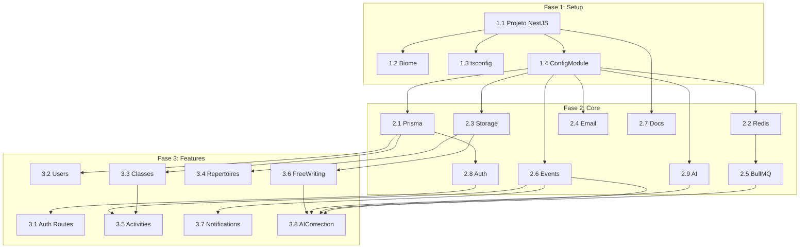

# Incita 2.0 Backend - Arquitetura de Refatoração

Este documento descreve a arquitetura, convenções e tecnologias para a refatoração do **essayer-server** para a nova estrutura baseada em NestJS/Prisma.

---

## Stack Tecnológica

| Categoria | Tecnologia |
|-----------|------------|
| Framework | NestJS 11 |
| ORM | Prisma 7 (PostgreSQL) |
| Validação | nestjs-zod + Zod 4 |
| Auth | better-auth + @thallesp/nestjs-better-auth |
| Filas | @nestjs/bullmq + ioredis |
| Eventos | @nestjs/event-emitter (EventEmitter2) |
| AI | Vercel AI SDK (abstração via interface) |
| Docs | Scalar (@scalar/nestjs-api-reference) |
| Linting | Biome |

---

## Estrutura de Diretórios

```
src/
├── main.ts                    # Bootstrap da aplicação
├── app.module.ts              # Módulo raiz
├── app.registry.ts            # Contexto global (getAppContext)
│
├── config/                    # Configuração centralizada
│   ├── config.module.ts
│   ├── config.service.ts
│   └── env.schema.ts          # Validação Zod das env vars
│
├── common/                    # Utilitários compartilhados
│   ├── decorators/
│   ├── dto/
│   ├── pipes/
│   ├── guards/
│   ├── filters/
│   ├── schemas/               # Schemas Zod reutilizáveis
│   └── templates/             # Templates de email
│
├── core/                      # Módulos de infraestrutura
│   ├── prisma/                # Conexão com banco
│   ├── redis/                 # Cliente Redis
│   ├── bullmq/                # Configuração de filas
│   ├── storage/               # Abstração de storage (IStorageProvider)
│   ├── email/                 # Abstração de email (IEmailProvider)
│   ├── auth/                  # Configuração better-auth
│   ├── docs/                  # Configuração Scalar
│   ├── events/                # Sistema de eventos tipados (pub/sub interno)
│   └── ai/                    # Abstração de IA (IAIProvider)
│
└── features/                  # Módulos de negócio
    ├── auth/
    ├── users/
    ├── classes/               # Turmas
    ├── repertoires/
    ├── activities/            # Atividades
    ├── free-writing/          # Redação Livre
    ├── notifications/         # Notificações de usuários + SSE
    └── ai-correction/         # Correção IA (BullMQ worker)
```

---

## Convenções de Código

### Idioma

> [!IMPORTANT]
> **Todo o código deve ser escrito em inglês**, incluindo:
> - Nomes de arquivos, classes, funções e variáveis
> - Comentários e documentação
> - Mensagens de erro e logs
> - Nomes de tabelas e colunas no banco de dados

### Nomenclatura de Arquivos

- **Arquivos**: `kebab-case` (ex: `classes.controller.ts`)
- **Classes**: `PascalCase` (ex: `ClassesController`)
- **Interfaces**: Prefixo `I` (ex: `IStorageProvider`)

### Estrutura de Feature

Cada feature segue esta estrutura:

```
features/{name}/
├── dto/
│   ├── create-{entity}.dto.ts
│   ├── update-{entity}.dto.ts
│   └── {entity}-response.dto.ts
├── {name}.controller.ts
├── {name}.service.ts
├── {name}.repository.ts       # Abstração do Prisma
└── {name}.module.ts
```

### DTOs com Zod

```typescript
// create-class.dto.ts
import { createZodDto } from 'nestjs-zod';
import { z } from 'zod';

export const createClassSchema = z.object({
  name: z.string().min(1, 'Name is required'),
  year: z.number().int().positive(),
});

export class CreateClassDto extends createZodDto(createClassSchema) {}
```

### Repository Pattern

Services **não** acessam Prisma diretamente:

```typescript
// classes.service.ts
@Injectable()
export class ClassesService {
  constructor(private readonly repository: ClassesRepository) {}

  async findOne(id: string) {
    const classEntity = await this.repository.findById(id);
    if (!classEntity) throw new NotFoundException('Class not found');
    return classEntity;
  }
}

// classes.repository.ts
@Injectable()
export class ClassesRepository {
  constructor(private readonly prisma: PrismaService) {}

  findById(id: string) {
    return this.prisma.class.findUnique({ where: { id } });
  }
}
```

---

## Padrão de Abstração (Storage/Email/AI)

Módulos externos seguem o padrão de interface + implementação + token:

```typescript
// types.ts
export interface IAIProvider {
  chat(messages: AIMessage[]): Promise<AIStreamResponse>;
  generate(prompt: string, system?: string): Promise<string>;
  generateObject<T>(prompt: string, schema: z.ZodSchema<T>): Promise<T>;
  chatWithAttachments(messages: AIMessage[], files: AIFile[]): Promise<AIStreamResponse>;
}

export const AI_PROVIDER = Symbol('AI_PROVIDER');

// providers/vercel-ai.provider.ts
@Injectable()
export class VercelAIProvider implements IAIProvider { ... }

// ai.module.ts
@Module({
  providers: [{
    provide: AI_PROVIDER,
    useClass: VercelAIProvider,
  }],
  exports: [AI_PROVIDER],
})
export class AIModule {}
```

### Email Provider

```typescript
// core/email/types.ts
export interface IEmailProvider {
  sendMail(options: SendMailOptions): Promise<void>;
}

export interface SendMailOptions {
  to: string | string[];
  subject: string;
  template: string;
  context?: Record<string, unknown>;
  attachments?: EmailAttachment[];
}

export const EMAIL_PROVIDER = Symbol('EMAIL_PROVIDER');

// core/email/providers/nodemailer.provider.ts
@Injectable()
export class NodemailerProvider implements IEmailProvider { ... }

// core/email/providers/mailjet.provider.ts
@Injectable()
export class MailjetProvider implements IEmailProvider { ... }
```

---

## Sistema de Eventos Tipados

O módulo `core/events/` fornece um sistema de pub/sub interno com payloads tipados usando `@nestjs/event-emitter`.

### Estrutura do Módulo

```
core/events/
├── events.module.ts           # Configuração do EventEmitterModule
├── events.types.ts            # Mapa de eventos tipados (AppEventMap)
└── payloads/                  # Payloads organizados por domínio
    ├── activity.payloads.ts
    ├── correction.payloads.ts
    └── index.ts               # Re-exporta todos os payloads
```

### Definição de Payloads

```typescript
// core/events/payloads/activity.payloads.ts
export class ActivitySubmittedPayload {
  constructor(
    public readonly activityId: string,
    public readonly recipients: string[],
  ) {}
}

export class ActivityClosedPayload {
  constructor(
    public readonly activityId: string,
    public readonly recipients: string[],
  ) {}
}
```

### Mapa de Eventos Tipados

```typescript
// core/events/events.types.ts
import { ActivitySubmittedPayload, ActivityClosedPayload } from './payloads';
import { AICorrectionCompletedPayload } from './payloads';

export interface AppEventMap {
  'activity.submitted': ActivitySubmittedPayload;
  'activity.closed': ActivityClosedPayload;
  'correction.ai.completed': AICorrectionCompletedPayload;
  'correction.ai.persisted': AICorrectionPersistedPayload;
}

export type AppEventName = keyof AppEventMap;
```

### Emitindo Eventos

```typescript
// features/activities/activities.service.ts
@Injectable()
export class ActivitiesService {
  constructor(private readonly eventEmitter: EventEmitter2) {}

  async close(id: string) {
    // ... lógica de negócio
    this.eventEmitter.emit(
      'activity.closed',
      new ActivityClosedPayload(id, studentIds),
    );
  }
}
```

### Ouvindo Eventos

```typescript
// features/notifications/notifications.listener.ts
@Injectable()
export class NotificationsListener {
  constructor(private readonly notificationsService: NotificationsService) {}

  @OnEvent('activity.closed', { async: true })
  async handleActivityClosed(payload: ActivityClosedPayload) {
    await this.notificationsService.notifyActivityClosed(
      payload.activityId,
      payload.recipients,
    );
  }
}
```

> [!NOTE]
> Os listeners são totalmente desacoplados dos emissores. O módulo de Activities não precisa conhecer o módulo de Notifications.

---

## Tarefas de Implementação

### Legenda
- 🔴 Bloqueante (precisa estar pronto antes das próximas)
- 🟡 Pode ser feito em paralelo com outras da mesma fase
- 🟢 Independente (pode ser feito em qualquer momento)

---

### Fase 1: Setup Base 🔴

| # | Tarefa | Deps |
|---|--------|------|
| 1.1 | Criar projeto NestJS limpo | - |
| 1.2 | Configurar Biome (linting/formatting) | 1.1 |
| 1.3 | Configurar tsconfig.json | 1.1 |
| 1.4 | Criar ConfigModule + env.schema.ts | 1.1 |

---

### Fase 2: Core Modules 🔴

| # | Tarefa | Deps | Paralelo |
|---|--------|------|----------|
| 2.1 | PrismaModule + PrismaService | 1.4 | 🟡 2.2, 2.3, 2.4 |
| 2.2 | RedisModule + REDIS_CLIENT provider | 1.4 | 🟡 2.1, 2.3, 2.4 |
| 2.3 | StorageModule (interface + cloudinary) | 1.4 | 🟡 2.1, 2.2, 2.4 |
| 2.4 | EmailModule (interface + nodemailer/mailjet) | 1.4 | 🟡 2.1, 2.2, 2.3 |
| 2.5 | BullMQModule (config de filas) | 2.2 | - |
| 2.6 | EventsModule (@nestjs/event-emitter) | 1.4 | 🟢 |
| 2.7 | DocsModule (Scalar) | 1.1 | 🟢 |
| 2.8 | AuthModule (better-auth) | 2.1 | - |
| 2.9 | AIModule (interface + Vercel AI SDK) | 1.4 | 🟢 |

---

### Fase 3: Features 🟡

Todas podem ser feitas em paralelo após Fase 2.

| # | Tarefa | Deps | Paralelo |
|---|--------|------|----------|
| 3.1 | Feature: Auth (routes/controller) | 2.8 | 🟡 todas |
| 3.2 | Feature: Users | 2.1, 2.8 | 🟡 todas |
| 3.3 | Feature: Classes | 2.1, 2.8 | 🟡 todas |
| 3.4 | Feature: Repertoires | 2.1, 2.3, 2.8 | 🟡 todas |
| 3.5 | Feature: Activities | 2.1, 2.6, 2.8, 3.3 | - |
| 3.6 | Feature: FreeWriting | 2.1, 2.3, 2.8 | 🟡 3.4 |
| 3.7 | Feature: Notifications (+ SSE) | 2.1, 2.6, 2.8 | 🟡 3.4 |
| 3.8 | Feature: AICorrection (BullMQ worker) | 2.5, 2.6, 2.9, 3.6 | - |

---

### Fase 4: Verificação 🔴

| # | Tarefa | Deps |
|---|--------|------|
| 4.1 | Verificar Auth (login/refresh/logout) | 3.1 |
| 4.2 | Verificar fluxo de Correção IA | 3.8 |
| 4.3 | Verificar Stream SSE | 3.7 |

---

## Diagrama de Dependências



---

## Ordem de Execução Otimizada

### Sprint 1 (Dias 1-2)
- **Paralelo A**: 1.1 → 1.2, 1.3, 1.4
- **Paralelo B** (após 1.4): 2.1, 2.2, 2.3, 2.4, 2.6, 2.7, 2.9

### Sprint 2 (Dias 3-4)
- **Sequencial**: 2.5 (depende de 2.2), 2.8 (depende de 2.1)
- **Paralelo**: 3.1, 3.2, 3.3

### Sprint 3 (Dias 5-7)
- **Paralelo**: 3.4, 3.6, 3.7
- **Sequencial**: 3.5 (depende de 3.3)

### Sprint 4 (Dias 8-9)
- **Sequencial**: 3.8 (depende de 2.5, 2.6, 2.9, 3.6)
- **Verificação**: 4.1, 4.2, 4.3

---

## Checklist de Progresso

### Fase 1: Setup Base 🔴

- [x] 1.1 - Criar projeto NestJS limpo
- [x] 1.2 - Configurar Biome (linting/formatting)
- [x] 1.3 - Configurar tsconfig.json
- [x] 1.4 - Criar ConfigModule + env.schema.ts

---

### Fase 2: Core Modules 🔴

- [x] 2.1  - PrismaModule + PrismaService
- [x] 2.2  - RedisModule + REDIS_CLIENT provider
- [x] 2.3  - StorageModule (interface + cloudinary)
- [x] 2.4  - EmailModule (interface + nodemailer/mailjet)
- [ ] 2.5  - BullMQModule (config de filas)
- [x] 2.6  - EventsModule (@nestjs/event-emitter)
- [x] 2.7  - DocsModule (Scalar)
- [x] 2.8  - AuthModule (better-auth)
- [ ] 2.9  - AIModule (interface + Vercel AI SDK)
- [x] 2.10 - LoggerModule (with email notifications)

---

### Fase 3: Features 🟡

- [ ] 3.1 - Feature: Auth (routes/controller)
- [ ] 3.2 - Feature: Users
- [ ] 3.3 - Feature: Classes
- [ ] 3.4 - Feature: Repertoires
- [ ] 3.5 - Feature: Activities
- [ ] 3.6 - Feature: FreeWriting
- [ ] 3.7 - Feature: Notifications (+ SSE)
- [ ] 3.8 - Feature: AICorrection (BullMQ worker)

---

### Fase 4: Verificação 🔴

- [ ] 4.1 - Verificar Auth (login/refresh/logout)
- [ ] 4.2 - Verificar fluxo de Correção IA
- [ ] 4.3 - Verificar Stream SSE
