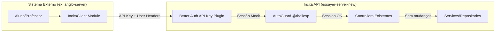

# Plano de Implementação - Integração Externa (Incita API)

Este documento detalha como o essayer-server-new (Incita) será adaptado para aceitar integrações de serviços externos, começando pelo anglo-server.

## Decisões Arquiteturais

### Autenticação Service-to-Service

O better-auth **possui** um plugin nativo de API Key: [`@better-auth/api-key`](https://better-auth.com/docs/plugins/api-key).

**Solução adotada:** Usar o plugin `@better-auth/api-key` com `enableSessionForAPIKeys: true`.

**Como funciona a transparência:**

O `AuthGuard` do `@thallesp/nestjs-better-auth` (v2.5.4) faz o seguinte no `canActivate()`:
1. Chama `auth.api.getSession({ headers: request.headers })` para obter a sessão
2. Seta `request.session = session` e `request.user = session?.user`
3. Verifica roles/permissions a partir de `session.user.role`

O plugin `@better-auth/api-key` com `enableSessionForAPIKeys: true` faz o `auth.api.getSession()` **retornar uma sessão mock** quando detecta um header `x-api-key` válido. O `AuthGuard` recebe essa sessão transparentmente — **zero mudanças nos controllers existentes**. O `@Session()`, `@Roles()`, `@OptionalAuth()` continuam funcionando normalmente.

**Por que isso é melhor que o guard customizado original:**
- Manutenção pelo ecossistema better-auth, não por nós
- Rate limiting nativo por API key
- Sistema de permissões nativo por API key
- Suporte a múltiplas configurações de API key (públicas, secretas, etc.)
- Storage com Redis (secondary-storage) para lookup rápido
- CRUD completo de keys via API do better-auth (create, list, update, delete, verify)
- Metadata em cada API key (para armazenar info da integração)

### Modelo de Integração



### Provisionamento de Usuários

Usuários de sistemas externos são **auto-provisionados** via um middleware/guard leve que roda **antes** do `AuthGuard`:

- O sistema externo envia headers com dados do usuário (`x-integration-user-id`, `x-integration-user-name`, etc.)
- O middleware busca um `IntegrationUser` mapeado para `(integrationName, externalUserId)`
- Se não existir, cria um `User` no banco do Incita + um `IntegrationUser` vinculando
- Usuários provisionados via integração são marcados com `emailVerified = true`
- O usuário provisionado é passado como `userId` para o `auth.api.getSession()` resolver a sessão

**Para professores:** O sistema externo pode enviar `x-integration-user-role: teacher`. O Incita apenas aceita se a integração tiver a scope `users:sync-teacher`.

### API Keys são "user-owned"

Cada integração terá um **usuário de serviço** (ex: `anglo-service@incita.local`) criado no better-auth. A API key pertence a esse usuário. Com `enableSessionForAPIKeys`, o `getSession` retorna uma sessão representando esse usuário de serviço.

**No entanto**, o usuário da sessão mock é o dono da API key (o serviço), não o usuário final (o professor/aluno do Anglo). Para que likes/favorites/comments funcionem em nome do usuário final, precisamos do middleware de provisionamento que resolve o usuário final e **ajusta a sessão** antes do `AuthGuard`.

### Preparação para Controle Granular (Futuro)

O plugin suporta `permissions` nativamente em cada API key (`Record<string, string[]>`). Na V1, todas as integrações recebem todas as permissões. Na V2, cada endpoint pode verificar permissões específicas via `auth.api.verifyApiKey({ permissions })`.

---

## Headers da Integração

O sistema externo envia estes headers em toda requisição autenticada:

| Header | Obrigatório | Descrição |
|--------|-------------|-----------|
| `x-api-key` | Sim | API key da integração (header padrão do plugin better-auth) |
| `x-integration-user-id` | Sim | ID do usuário no sistema externo |
| `x-integration-user-name` | Auto-provision | Nome do usuário (necessário apenas na 1ª requisição) |
| `x-integration-user-email` | Auto-provision | Email do usuário (necessário apenas na 1ª requisição) |
| `x-integration-user-role` | Não | Role do usuário (default: "student") |

> **Nota:** O header `x-api-key` é o padrão do plugin. Pode ser customizado via `apiKeyHeaders` se necessário.

---

## Mudanças no Schema (Prisma)

### Novo Model (apenas para mapeamento de usuários)

O plugin `@better-auth/api-key` cria automaticamente a tabela `apikey` via migration do better-auth. Não precisamos criar models de integração manualmente.

Precisamos apenas do model `IntegrationUser` para mapear usuários externos:

```prisma
// ============================================
// INTEGRATION USER MAPPING
// ============================================

model IntegrationUser {
  id             String   @id @default(uuid(7))
  integrationName String                     // Nome da integração (ex: "anglo-platform")
  userId         String
  user           User @relation(fields: [userId], references: [id], onDelete: Cascade)
  externalUserId String                        // ID do usuário no sistema externo
  externalRole   String   @default("student")  // Role no sistema externo (para referência)
  createdAt      DateTime @default(now())
  updatedAt      DateTime @updatedAt

  @@unique([integrationName, externalUserId])
  @@index([userId])
  @@index([externalUserId])
  @@map("integration_user")
}
```

### Modificações no Model User

Adicionar relação:

```prisma
model User {
  // ... campos existentes ...
  integrationMappings IntegrationUser[]  // Relação nova
}
```

### Tabela `apikey` (gerenciada pelo plugin)

O plugin cria automaticamente:

| Campo | Tipo | Descrição |
|-------|------|-----------|
| `id` | string PK | ID da API key |
| `configId` | string | ID da configuração (default: "default") |
| `name` | string? | Nome da key |
| `start` | string? | Primeiros caracteres (para identificação visual) |
| `prefix` | string? | Prefixo da key |
| `key` | string | Hash da API key |
| `referenceId` | string | ID do dono (userId ou orgId) |
| `permissions` | string? | Permissões em JSON |
| `metadata` | string? | Metadata em JSON |
| `rateLimitEnabled` | boolean? | Rate limiting ativado |
| `rateLimitTimeWindow` | number? | Janela de tempo do rate limit |
| `rateLimitMax` | number? | Máximo de requests na janela |
| `remaining` | number? | Requests restantes |
| `expiresAt` | Date? | Data de expiração |
| `enabled` | boolean? | Key ativa |
| `createdAt` | Date | Data de criação |
| `updatedAt` | Date | Data de atualização |

---

## Estrutura de Arquivos a Criar

```
src/
├── core/
│   ├── auth/
│   │   └── auth.ts                          # MODIFICAR: adicionar plugin apiKey()
│   └── integration/
│       ├── integration.module.ts            # Módulo global com middleware registrado
│       ├── integration.middleware.ts        # Middleware de provisionamento de usuários
│       ├── integration.service.ts           # Lógica de provisionamento
│       ├── integration.repository.ts        # Queries no banco
│       └── types.ts                         # Interfaces
│
└── scripts/
    └── seed-integration.ts                  # Seed: cria service user + API key de dev
```

> **Nota:** Não precisamos mais de `src/features/integration/` com endpoints admin de gerenciamento. O plugin better-auth já expõe `auth.api.createApiKey()`, `auth.api.listApiKeys()`, etc. Se quisermos endpoints REST, podemos usar os endpoints nativos do better-auth.

---

## Passo a Passo de Implementação

### Fase 1: Infraestrutura de Integração (essayer-server-new)

#### Passo 1.1 - Instalar plugin + Configurar better-auth

- [ ] Instalar `@better-auth/api-key`
- [ ] Adicionar plugin `apiKey()` ao `auth.ts` com as opções:
  ```typescript
  import { apiKey } from '@better-auth/api-key';

  export const auth = betterAuth({
    // ... config existente ...
    plugins: [
      openAPI({ path: '/docs', disableDefaultReference: true }),
      adminPlugin({
        ac,
        roles: { admin, teacher, student },
        defaultRole: 'student',
      }),
      apiKey({
        enableSessionForAPIKeys: true,
        requireName: true,
        enableMetadata: true,
        permissions: {
          defaultPermissions: {
            repertoires: ['read', 'write'],
            users: ['provision'],
          },
        },
      }),
    ],
  });
  ```
- [ ] Rodar `npx @better-auth/cli generate` para gerar a migration do plugin
- [ ] Aplicar migration

**Entregável:** Plugin configurado + migration aplicada.

---

#### Passo 1.2 - Schema e Migration (IntegrationUser)

- [ ] Adicionar model `IntegrationUser` ao `schema.prisma`
- [ ] Adicionar relação `integrationMappings` ao model `User`
- [ ] Rodar `npx prisma migrate dev --name add-integration-user-mapping`
- [ ] Gerar cliente Prisma

**Entregável:** Migration + schemas atualizados.

---

#### Passo 1.3 - Core Integration Module (Provisionamento)

- [ ] Criar `src/core/integration/types.ts`
  ```typescript
  export const INTEGRATION_SERVICE = Symbol('INTEGRATION_SERVICE');

  export interface ResolvedIntegrationUser {
    userId: string;
    externalUserId: string;
    externalRole: string;
    integrationName: string;
    isNewUser: boolean;
  }

  export const INTEGRATION_SCOPES = {
    REPERTOIRES_READ: 'repertoires:read',
    REPERTOIRES_WRITE: 'repertoires:write',
    USERS_PROVISION: 'users:provision',
    USERS_SYNC_TEACHER: 'users:sync-teacher',
  } as const;
  ```

- [ ] Criar `src/core/integration/integration.repository.ts`
  - `findIntegrationUser(integrationName, externalUserId)` — busca mapeamento existente
  - `createIntegrationUser(data)` — cria mapeamento + usuário no banco
  - `findUserByEmail(email)` — busca user por email
  - `findUserById(userId)` — busca user por ID

- [ ] Criar `src/core/integration/integration.service.ts`
  - `resolveOrCreateUser(integrationName, externalUserId, externalRole, userName?, userEmail?)` — resolve ou auto-provisiona

- [ ] Criar `src/core/integration/integration.middleware.ts`
  - Middleware NestJS que roda **antes** do `AuthGuard`
  - Detecta se a requisição tem header `x-integration-user-id`
  - Se sim:
    1. Verifica se `x-api-key` está presente (se não, pula — não é requisição de integração)
    2. Valida a API key via `auth.api.verifyApiKey()` (para obter metadata da integração)
    3. Resolve ou provisiona o usuário via `IntegrationService`
    4. Ajusta os headers da requisição para que o `getSession()` do better-auth retorne a sessão do **usuário final** (não do service user)
  - Se não: não faz nada

  **Detalhe crítico:** O `enableSessionForAPIKeys` cria uma sessão para o **dono da API key** (o service user). Precisamos que a sessão represente o **usuário final** (professor/aluno). Existem duas abordagens:

  **Abordagem A (Recomendada):** O middleware de provisionamento:
  1. Detecta headers de integração
  2. Resolve o usuário final (provisionado)
  3. Deixa o `AuthGuard` criar a sessão mock do service user via API key
  4. Cria um **segundo guard** ( leve, que roda depois do AuthGuard) que substitui `request.session.user` pelo usuário final provisionado

  **Abordagem B:** Não usar `enableSessionForAPIKeys`. Em vez disso:
  1. O middleware de provisionamento valida a API key manualmente
  2. Resolve o usuário final
  3. Injeta sessão fake em `request.session` e `request.user`
  4. O `AuthGuard` precisa ser contornado com `@AllowAnonymous()` nos endpoints de integração — **não ideal**, perde verificação de roles

  **Decisão:** Usaremos a **Abordagem A**. Isso preserva toda a cadeia de autenticação e autorização sem modificar controllers.

  ```typescript
  @Injectable()
  export class IntegrationUserMiddleware implements NestMiddleware {
    constructor(private readonly integrationService: IntegrationService) {}

    async use(req: Request, res: Response, next: NextFunction) {
      const externalUserId = req.headers['x-integration-user-id'] as string;
      if (!externalUserId) return next();

      const apiKey = req.headers['x-api-key'] as string;
      if (!apiKey) return next();

      const integrationName = req.headers['x-integration-name'] as string;
      const externalRole = (req.headers['x-integration-user-role'] as string) || 'student';
      const userName = req.headers['x-integration-user-name'] as string;
      const userEmail = req.headers['x-integration-user-email'] as string;

      const resolved = await this.integrationService.resolveOrCreateUser(
        integrationName || 'default',
        externalUserId,
        externalRole,
        userName,
        userEmail,
      );

      req['integrationUser'] = resolved;
      next();
    }
  }
  ```

- [ ] Criar `src/core/integration/integration.guard.ts` — Guard que roda **depois** do `AuthGuard`:
  ```typescript
  @Injectable()
  export class IntegrationUserGuard implements CanActivate {
    async canActivate(context: ExecutionContext): Promise<boolean> {
      const request = context.switchToHttp().getRequest();
      const integrationUser = request['integrationUser'];

      if (integrationUser && request.session) {
        // Substituir o user da sessão mock (service user) pelo usuário final provisionado
        const user = await this.findUserById(integrationUser.userId);
        request.session.user = {
          id: user.id,
          name: user.name,
          email: user.email,
          emailVerified: true,
          image: user.image ?? null,
          role: user.role ?? integrationUser.externalRole,
          createdAt: user.createdAt,
          updatedAt: user.updatedAt,
        };
        request.user = request.session.user;
      }

      return true;
    }
  }
  ```

- [ ] Criar `src/core/integration/integration.module.ts`
  ```typescript
  @Global()
  @Module({
    providers: [
      IntegrationRepository,
      IntegrationService,
      {
        provide: APP_GUARD,
        useClass: IntegrationUserGuard,
      },
    ],
    exports: [IntegrationService],
  })
  export class IntegrationModule implements NestModule {
    configure(consumer: MiddlewareConsumer) {
      consumer.apply(IntegrationUserMiddleware).forRoutes('*');
    }
  }
  ```

- [ ] Registrar `IntegrationModule` no `app.module.ts` — deve ser importado **depois** do `AuthModule` para que o guard rode depois do `AuthGuard`

**Como testar:**
- Criar um service user + API key (via script ou better-auth CLI)
- Fazer request para `GET /repertoire` com headers `x-api-key` e `x-integration-user-id`
- Verificar se retorna repertórios normalmente com o usuário correto

**Entregável:** Middleware + guard + service funcionando.

---

#### Passo 1.4 - Seed Script para Dev

- [ ] Criar `scripts/seed-integration.ts` para:
  1. Criar um **service user** no better-auth (ex: `anglo-service@incita.local`, role: `admin`)
  2. Criar uma API key para esse service user via `auth.api.createApiKey()`
  3. Exibir a API key no console para uso nos testes
  4. Criar o mapeamento `IntegrationUser` para um usuário de teste

  ```typescript
  // Exemplo de uso do seed:
  // npx ts-node scripts/seed-integration.ts
  //
  // Output:
  // Service user created: anglo-service@incita.local (id: xxx)
  // API Key: incita_anglo_dev_xxxxxxxxxxxxxxxxxxxxxxxxxxxxxxxx
  // Integration user mapping created for: test-student@anglo.local
  ```

**Entregável:** Script funcional com instruções no README.

---

### Fase 2: Testes E2E (essayer-server-new)

#### Passo 2.1 - Testes do Plugin + Middleware

- [ ] Testar que request sem API key funciona normalmente (auth por sessão cookie)
- [ ] Testar que request com API key inválida retorna 401
- [ ] Testar que request com API key válida (sem integration headers) retorna sessão do service user
- [ ] Testar que request com API key + headers de integração retorna sessão do usuário final
- [ ] Testar auto-provisionamento: primeira requisição cria usuário no banco
- [ ] Testar que segunda requisição reutiliza o mesmo usuário provisionado
- [ ] Testar que `@Roles(['admin', 'teacher'])` funciona com a role passada no header
- [ ] Testar que `@OptionalAuth()` funciona com e sem API key

#### Passo 2.2 - Testes de Proxy de Repertórios via Integração

- [ ] `GET /repertoire` com API key + integration headers → retorna repertórios com `favourited`/`liked` do usuário mapeado
- [ ] `POST /repertoire/:id/like` com API key → curtir funciona
- [ ] `DELETE /repertoire/:id/like` com API key → descurtir funciona
- [ ] `POST /repertoire/:id/favorite` com API key → favoritar funciona
- [ ] `DELETE /repertoire/:id/favorite` com API key → desfavoritar funciona
- [ ] `POST /work` com API key + role teacher → criar obra funciona
- [ ] `POST /work` com API key + role student → retorna 403
- [ ] `POST /repertoire/:id/comment` com API key + role teacher → comentar funciona

---

### Fase 3: Mudanças no anglo-server

> **Nota:** Estas mudanças ocorrem no projeto `anglo-server`, não aqui.
> Estão documentadas para referência completa da integração.

#### Passo 3.1 - IncitaClient Core Module

- [ ] Criar `src/core/incita-client/` no anglo-server
  - `incita-client.module.ts`
  - `incita-client.service.ts` — encapsula chamadas HTTP ao essayer-server-new
  - `types.ts` — tipos de request/response mapeados do Incita

- [ ] Adicionar ao `env.schema.ts`:
  ```
  INCITA_API_URL: z.string().min(1)
  INCITA_API_KEY: z.string().min(1)
  ```

- [ ] O `IncitaClientService` deve:
  - Adicionar headers `x-api-key`, `x-integration-user-id`, `x-integration-user-name`, `x-integration-user-email`, `x-integration-user-role`, `x-integration-name` em toda requisição
  - Mapear `User.incitaUserId` → `x-integration-user-id`
  - Mapear role `professor` → `teacher`
  - Mapear payloads de response do Incita para DTOs do Anglo
  - Reescrever URLs de paginação (`nextPageUrl`, `previousPageUrl`) do domínio Incita para o domínio Anglo

#### Passo 3.2 - Sincronização de Usuários

- [ ] Ao criar professor via `POST /api/admin/professors`:
  - Após criar no banco do Anglo, chamar Incita com API key + dados do professor
  - O auto-provisionamento do Incita cria o usuário e retorna via response
  - Armazenar `incitaUserId` no banco do Anglo
- [ ] Ao criar aluno: não sincronizar imediatamente. Sincronizar on-demand (lazy) na primeira interação com repertórios.

#### Passo 3.3 - Feature Repertórios (Proxy Leitura + Interação)

- [ ] Criar `src/features/repertoires/` no anglo-server
- [ ] Endpoints proxy para alunos:
  - `GET /api/repertoires` → `IncitaClient.getAllRepertoires()`
  - `GET /api/repertoires/bulk-search` → `IncitaClient.getByIds()`
  - `POST /api/repertoires/:id/like` → `IncitaClient.createLike()`
  - `DELETE /api/repertoires/:id/like` → `IncitaClient.deleteLike()`
  - `POST /api/repertoires/:id/favorite` → `IncitaClient.createFavorite()`
  - `DELETE /api/repertoires/:id/favorite` → `IncitaClient.deleteFavorite()`

#### Passo 3.4 - Feature Repertórios (Proxy Criação)

- [ ] Endpoints proxy para professores/admin:
  - `POST /api/repertoires/work` → `IncitaClient.createWork()`
  - `POST /api/repertoires/article` → `IncitaClient.createArticle()`
  - `POST /api/repertoires/citation` → `IncitaClient.createCitation()`
  - `POST /api/repertoires/:id/comment` → `IncitaClient.createComment()`
  - `PUT /api/repertoires/comment/:id` → `IncitaClient.updateComment()`
  - `DELETE /api/repertoires/comment/:id` → `IncitaClient.deleteComment()`
  - `DELETE /api/repertoires/:id` → `IncitaClient.deleteRepertoire()`
- [ ] Guard `IncitaVerifiedGuard`: verifica se professor tem `incitaVerified = true` antes de permitir criação

---

## Diagrama de Fluxo

### Request via Integração (ex: aluno do Anglo visualizando repertórios)

```
Aluno no app Anglo
    │
    ▼
GET /api/repertoires?topics=filosofia
    │ (anglo-server)
    ▼
IncitaClientService.getAllRepertoires()
    │ Adiciona headers:
    │   x-api-key: <key>
    │   x-integration-name: anglo-platform
    │   x-integration-user-id: <incitaUserId>
    │   x-integration-user-role: student
    ▼
GET /repertoire?topics=filosofia
    │ (essayer-server-new)
    ▼
IntegrationUserMiddleware (NestJS Middleware)
    ├── Detecta x-integration-user-id
    ├── Valida x-api-key via auth.api.verifyApiKey()
    ├── Resolve ou provisiona IntegrationUser
    ├── Seta req['integrationUser'] = { userId, externalUserId, ... }
    ▼
AuthGuard (@thallesp/nestjs-better-auth)
    ├── Chama auth.api.getSession({ headers }) → detecta x-api-key
    ├── Plugin apiKey retorna sessão mock do service user
    ├── Seta request.session = mockSession
    ▼
IntegrationUserGuard (APP_GUARD, roda depois)
    ├── Detecta req['integrationUser']
    ├── Substitui request.session.user pelo usuário final provisionado
    ├── request.session.user.role = "student"
    ▼
RepertoireController.getAll()
    ├── @Session() session → recebe session com user correto
    ├── session.user.id → ID do usuário provisionado no Incita
    ▼
RepertoireService.getAll(query, userId)
    │ Retorna repertórios com liked/favourited corretos
    ▼
Response → IncitaClient → Conversão → Response Anglo
```

---

## Ordem de Execução

| Ordem | Tarefa | Projeto | Duração Estimada | Deps |
|-------|--------|---------|-------------------|------|
| 1 | 1.1 Instalar plugin + Config auth.ts | essayer | 30min | - |
| 2 | 1.2 Schema + Migration (IntegrationUser) | essayer | 30min | - |
| 3 | 1.3 Core Integration Module (middleware + guard + service) | essayer | 2-3h | 1.1, 1.2 |
| 4 | 1.4 Seed Script | essayer | 30min | 1.3 |
| 5 | 2.1-2.2 Testes E2E | essayer | 2-3h | 1.4 |
| 6 | 3.1 IncitaClient Module | anglo | 2h | 1.3 |
| 7 | 3.2 User Sync | anglo | 2h | 3.1 |
| 8 | 3.3 Proxy Leitura | anglo | 2h | 3.1 |
| 9 | 3.4 Proxy Criação | anglo | 2h | 3.3 |

**Total estimado:** ~13-16h de trabalho (3h a menos que o plano original com guard customizado)

---

## Comparação com o Plano Anterior (Guard Customizado)

| Critério | Plano anterior (guard custom) | Plano atual (plugin better-auth) |
|----------|-------------------------------|----------------------------------|
| Models Prisma | `Integration` + `IntegrationUser` | Apenas `IntegrationUser` |
| Tabela de API keys | Gerenciada manualmente por nós | Gerenciada pelo plugin (auto-migration) |
| Admin endpoints | 5 endpoints customizados | Nativos do better-auth |
| Guard custom | `IntegrationGuard` completo | Apenas `IntegrationUserGuard` leve |
| Hash/validação de API key | Implementação manual | Plugin cuida |
| Rate limiting | Teria que implementar | Nativo do plugin |
| Permissões por key | Teria que implementar | Nativo do plugin |
| Arquivos a criar | ~15 arquivos | ~7 arquivos |
| Estimativa total | 16-18h | 13-16h |

---

## Checklist de Progresso

### Fase 1: Infraestrutura de Integração

- [ ] 1.1 - Instalar @better-auth/api-key + Configurar auth.ts
- [ ] 1.2 - Schema + Migration (IntegrationUser)
- [ ] 1.3 - Core Integration Module (middleware + guard + service)
- [ ] 1.4 - Seed Script para Dev

### Fase 2: Testes E2E

- [ ] 2.1 - Testes do Plugin + Middleware
- [ ] 2.2 - Testes de Proxy de Repertórios via Integração

### Fase 3: Anglo-Server (documentado aqui para referência)

- [ ] 3.1 - IncitaClient Core Module
- [ ] 3.2 - Sincronização de Usuários
- [ ] 3.3 - Proxy Repertórios (Leitura + Interação)
- [ ] 3.4 - Proxy Repertórios (Criação)
